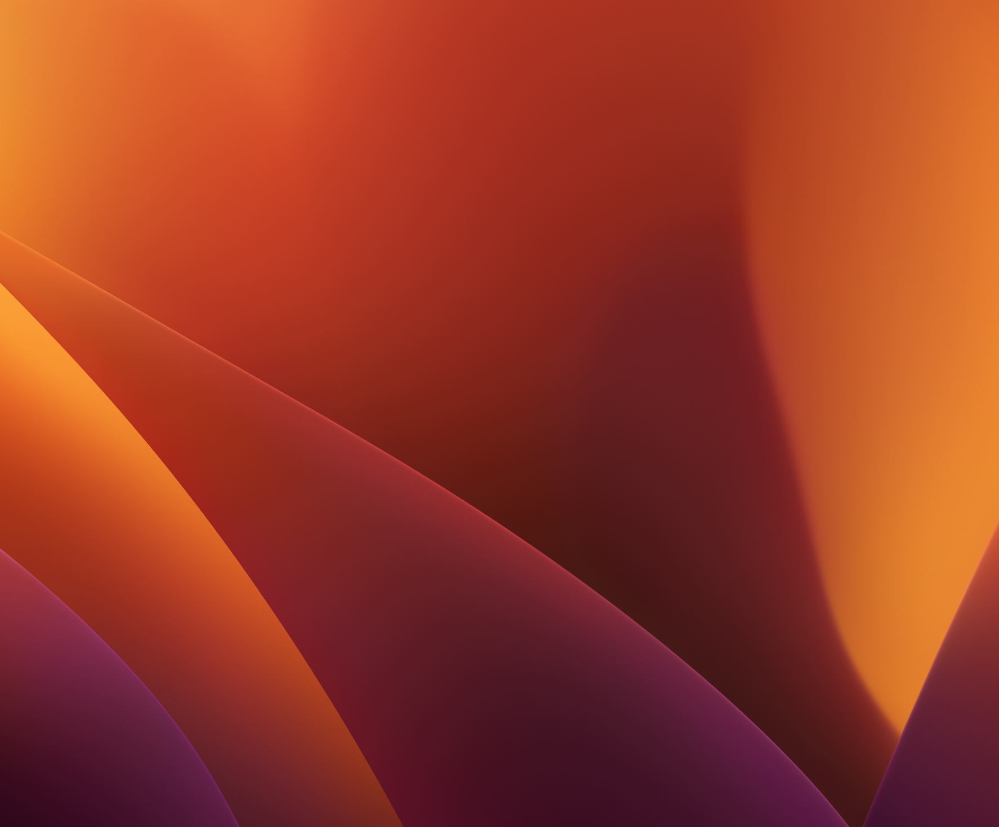
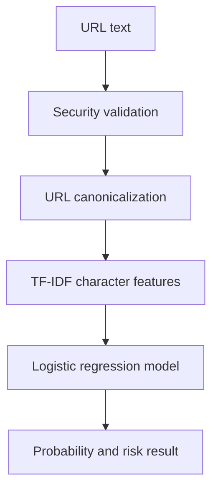

# 🛡️ PhishGuard AI

A beginner-friendly AI cybersecurity project that detects potentially phishing URLs using only URL text.

The application runs locally and never opens, visits, or connects to submitted websites.

## Cybersecurity problem

Phishing websites imitate trusted services to steal passwords, payment information, and personal data. PhishGuard AI provides a phishing-risk prediction before a user visits a suspicious URL.

This tool provides decision support only. It is not a security guarantee.

## Live Demo

Try the public application:

[Open PhishGuard AI](https://phishguard-ai-vcfnrdpzfa4ifhfsa5byok.streamlit.app)

The application analyzes only URL text. It does not open the submitted website or perform a network request.

## Application Screenshot



## Main features

- Machine-learning phishing detection
- Local URL-text analysis
- Streamlit web interface
- HTTP and HTTPS validation
- URL canonicalization to reduce misleading patterns
- Phishing probability and risk level
- Automated unit, security, model, and UI tests
- Hostname-separated model evaluation
- GitHub Actions continuous integration
- No paid API, cloud service, or GPU required

## System architecture



## Technology stack

- Python 3.13
- pandas
- scikit-learn
- Streamlit
- pytest
- joblib
- UCI ML Repository
- Git and GitHub Actions

The model uses a TF-IDF character representation and logistic regression. TF-IDF converts URL character patterns into numerical features that the model can process.

## Dataset

This project uses the public [PhiUSIIL Phishing URL Dataset](https://archive.ics.uci.edu/dataset/967/phiusiil%2Bphishing%2Burl%2Bdataset) from the UCI Machine Learning Repository.

After preprocessing:

- Total clean records: 235,362
- Legitimate records: 134,850
- Phishing records: 100,512
- Duplicate, empty, and invalid records are removed
- URLs are treated only as plain text
- No website from the dataset is opened

The dataset is licensed separately under the Creative Commons Attribution 4.0 International licence.

### Dataset citation

Prasad, A. and Chandra, S. (2024). *PhiUSIIL Phishing URL (Website)*. UCI Machine Learning Repository.

## Model evaluation

Two evaluation methods were used.

| Metric | Random split | Hostname-separated split |
|---|---:|---:|
| Accuracy | 88.55% | 87.99% |
| Balanced accuracy | — | 86.49% |
| Phishing precision | 94.44% | 94.58% |
| Phishing recall | 77.76% | 76.25% |
| Phishing F1 score | 85.30% | 84.43% |
| ROC AUC | 93.31% | 93.05% |
| False positives | 920 | 879 |
| False negatives | 4,470 | 4,775 |

The hostname-separated evaluation prevents the same hostname from appearing in both training and testing data. This is a more difficult and realistic test.

The phishing recall of 76.25% means that some phishing URLs are not detected. The application clearly communicates this limitation.

## Security controls

- Only HTTP and HTTPS URLs are accepted
- Input length is restricted
- The application performs no DNS lookup
- The application performs no network request
- Submitted websites are never opened
- Submitted URLs are not permanently stored
- Dataset and trained-model files are excluded from Git
- Errors are handled without displaying sensitive system details
- Automated tests check malicious and malformed inputs

Never load an untrusted `.joblib` model file. Serialized model files can be dangerous if they come from an unknown source.

## Project structure

```text
phishguard-ai/
├── .github/workflows/tests.yml
├── app/
│   └── streamlit_app.py
├── data/
│   ├── raw/
│   └── processed/
├── models/
├── reports/
├── scripts/
│   ├── download_data.py
│   └── preprocess_data.py
├── src/
│   ├── evaluate.py
│   ├── features.py
│   ├── predict.py
│   ├── security.py
│   └── train.py
├── tests/
│   ├── test_app.py
│   ├── test_features.py
│   ├── test_model.py
│   └── test_security.py
├── .gitignore
├── LICENSE
├── README.md
└── requirements.txt
```

## Installation

### 1. Create a virtual environment

```bash
python3.13 -m venv .venv
source .venv/bin/activate
```

### 2. Install dependencies

```bash
python -m pip install -r requirements.txt
```

## Reproduce the project

### 1. Download the dataset

```bash
python scripts/download_data.py
```

### 2. Preprocess the dataset

```bash
python scripts/preprocess_data.py
```

### 3. Train the model

```bash
python -m src.train
```

The trained model is saved locally under `models/`. It is excluded from Git and must be generated before running real predictions.

### 4. Run the stronger evaluation

```bash
python -m src.evaluate
```

Evaluation results are saved under `reports/`.

### 5. Run all automated tests

```bash
python -m pytest -q
```

Current result:

```text
37 passed
```

### 6. Start the application

```bash
python -m streamlit run app/streamlit_app.py
```

The application normally opens at:

```text
http://localhost:8501
```

## Example use

1. Start the Streamlit application.
2. Enter an HTTP or HTTPS URL.
3. Select **Analyze URL**.
4. Review the phishing probability, confidence, and risk level.
5. Do not visit suspicious websites based only on the model result.

## Limitations

- The model analyzes URL text only
- It does not inspect website content
- It does not check DNS, certificates, redirects, or domain age
- Predictions can be incorrect
- Dataset bias can affect results on new URLs
- The model may miss approximately 24% of phishing samples in the hostname-separated test
- It should not replace browser protection or professional security tools

## Testing

The project contains automated tests for:

- URL feature generation
- URL canonicalization
- Model prediction handling
- Invalid schemes such as `javascript:`
- Empty and malformed input
- Oversized input
- HTML escaping
- Probability validation
- Streamlit application startup
- Empty-form validation

GitHub Actions runs the tests automatically for pushes and pull requests to the `main` branch.

## Future improvements

- Compare additional lightweight ML models
- Add explainable model features
- Evaluate with a second independent dataset
- Add a FastAPI prediction endpoint
- Add model-version metadata
- Add Docker support
- Improve phishing recall while controlling false positives

## Ethical use

This project is intended for education, defensive cybersecurity research, and portfolio demonstration. It must not be used to create, host, or distribute phishing content.

## Author

**Md Fazle Rabbi Khan**  
M.Sc. Cyber Security student  
BTU Cottbus-Senftenberg, Germany

## Licence

Project source code is available under the [MIT Licence](LICENSE).

The UCI dataset is not included in the repository and remains subject to its own CC BY 4.0 licence.